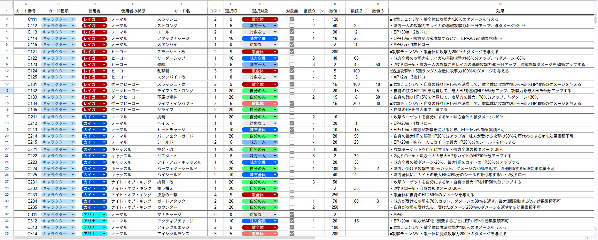
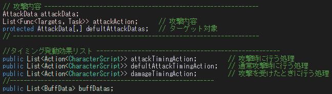
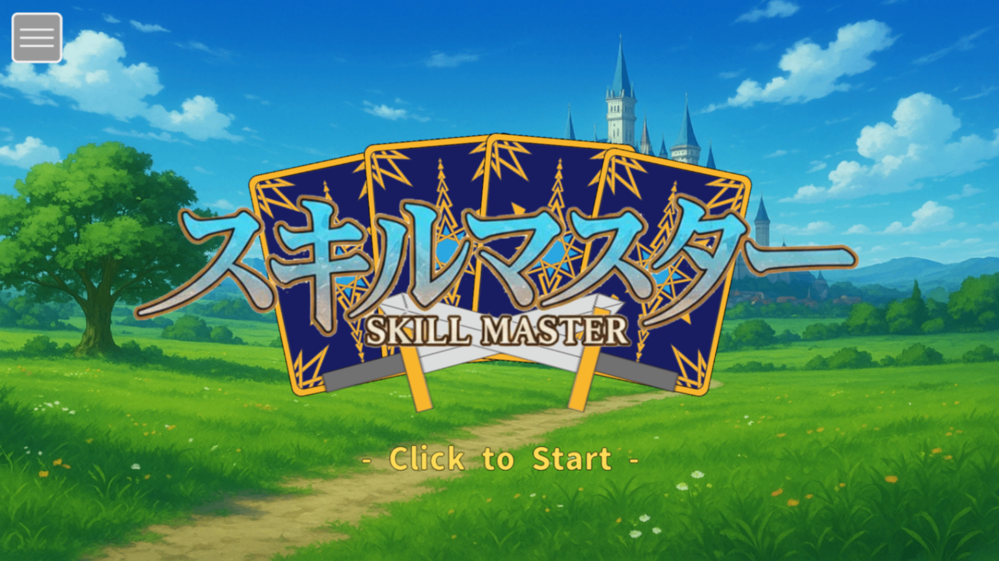
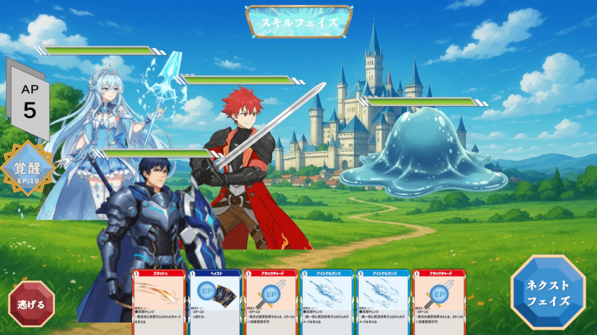

# スキルマスター

Unityで制作したコマンドバトル型カードゲームです。  
データベース管理・拡張性のあるバトルシステム設計を学ぶことを目的に制作しました。

## 概要
キャラクターがスキルや覚醒能力を駆使して戦う**ターン制コマンドバトルゲーム**です。 
キャラクターには潜在能力があり、EPを貯めることで潜在覚醒することができます。 
データをスプレッドシートで管理し、セーブはJSON形式でローカル保存しています。 
スキルは関数配列で管理し、呼び出しと追加をしやすくしています。 
&nbsp;

## 使用技術
- Unity 6000.0.43f1
- C#
- Google / DOTween / Addressables

## 見てほしいコード
- DataBaseManager.cs
  `Assets/1.スクリプト/DataBaseManager.cs`
- GameDirector.cs
  `Assets/1.スクリプト/Scene_Game/GameDirector.cs`
- CharacterScript.cs
  `Assets/1.スクリプト/CharacterScript.cs`

## 動作デモ
https://youtu.be/WZMck0xcrZQ?si=aIrztMlGmc9jQEkZ

## 制作期間
3ヶ月

## 制作体制
個人制作